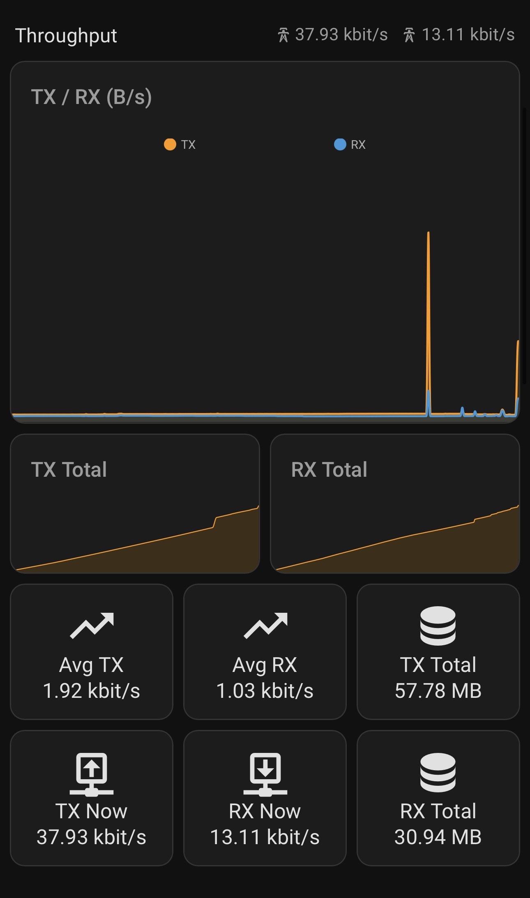
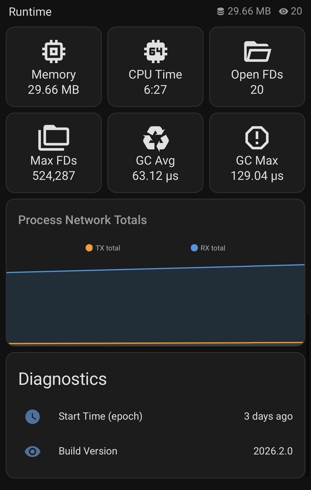
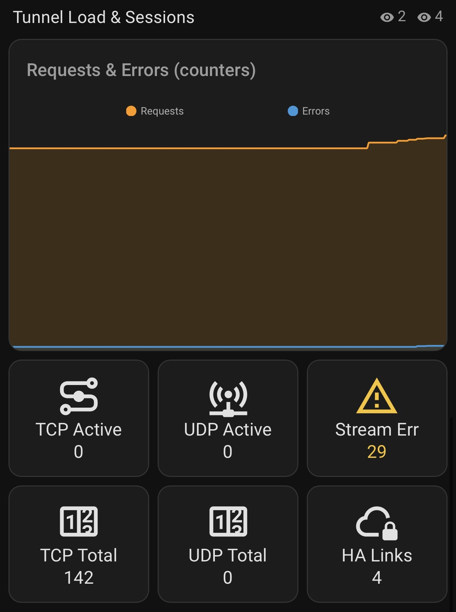
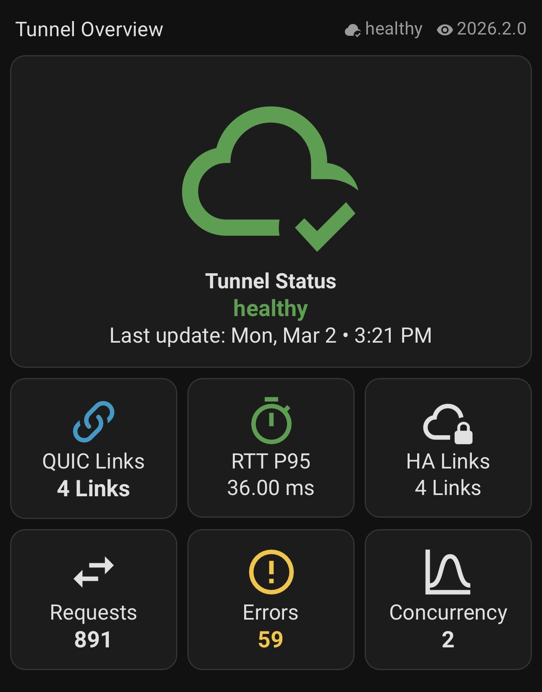
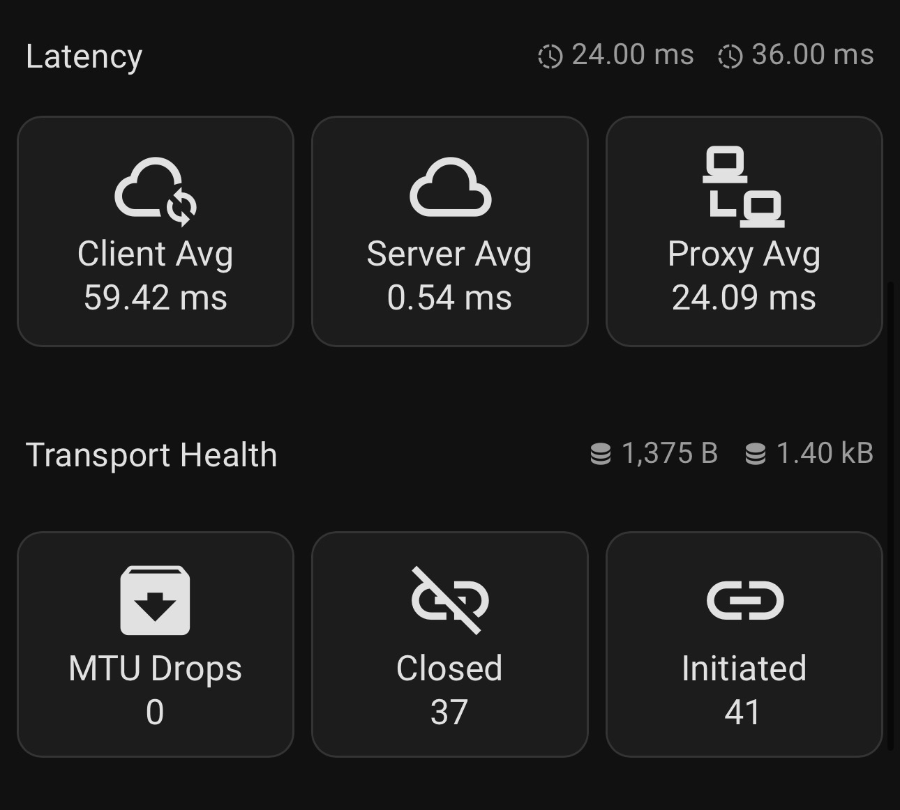

<div>


# ☁️ Cloudflare Tunnel Monitor – Home Assistant Integration 

[![hacs][hacs-badge]][hacs]
[![GitHub Release][releases-badge]][releases]
[![GitHub Activity][commits-badge]][commits]
[![Github Contributors][contributors-badge]][contributors]
[![License][license-badge]][license]
</div>

## 📌 Description

Cloudflare Tunnel Monitor is a Home Assistant integration that lets you **see tunnel health at a glance** and (optionally) turn cloudflared’s Prometheus endpoint into a **rich set of performance + reliability sensors**.

- ✅ **Tunnel status sensors** (healthy / degraded / inactive / down) via the Cloudflare API  
- 📈 **Optional cloudflared Prometheus metrics** for RTT, throughput, latency baselines, request errors, sessions, and process health

Prometheus metrics support has been implemented — thanks to [@tannerln7](https://github.com/tannerln7).

## ✨ Features

### ✅ Tunnel Status (Cloudflare API)
- 🟢🟡🔴 Sensors for each tunnel’s current health state: `healthy / degraded / inactive / down`
- 🧭 Perfect for Lovelace dashboards, alerts, and “is my remote access alive?” checks
- 🔔 Build automations like: notify on `down`, or only allow actions when tunnel is `healthy`

### 📈 Metrics Mode
When you provide a `metrics_url`, the integration unlocks **~50 additional sensors** that give you **real operational visibility** into your tunnel and the cloudflared process.

#### ⚡ QUIC Health & Latency:
- 🔗 **Active QUIC connections**
- ⏱️ **RTT percentiles** computed in ms across current connections:
  - min / avg / p50 / p75 / p95 / max
- ✅ Great for spotting “it’s up, but it’s *slow*” problems and tail latency spikes

#### 🌊 Throughput:
- 📦 **Total bytes sent/received** since start
- 🚀 **Bytes/sec** right now
- 🧾 **Average bytes/sec** since start
- ✅ Great for dashboards, utilization tracking, and detecting sudden changes

#### 🧠 QUIC Transport “Shape”:
- 🪟 **Congestion window** (min/avg/max bytes)
- 📏 **MTU** (min/avg/max bytes)
- 📬 **Max UDP payload** (min/avg/max bytes)
- ✅ Useful aggregate signals for diagnosing path/MTU issues, congestion, and network changes

#### 🧭 Latency Baselines:
- 🔌 **Proxy connect latency avg since start**
- 🛰️ **RPC client/server latency avg since start**
- ✅ Lets you establish “normal” and detect drift over time

#### 🧹 Go Runtime / GC Health
- 🧯 **Average GC pause since start**
- 🧨 **Worst GC pause observed**
- ✅ Helps catch resource pressure or noisy-neighbor issues on smaller hosts

#### 🛡️ Tunnel Operational Metrics
- 🔄 HA connections
- 📈 Concurrent requests per tunnel
- 🧾 Total proxied requests
- ❌ Request / stream errors
- 🌐 TCP/UDP active + total sessions
- 🔁 QUIC connections initiated/closed + packet-too-big drops
- ✅ Great for reliability monitoring and “something’s failing upstream” alerts

#### 🩺 Process Health
- 🕒 Process start time
- 🧠 Resident memory usage
- 🧮 CPU seconds total
- 📂 Open/max file descriptors
- 📡 Process network bytes in/out
- ✅ Enables automations like: “restart cloudflared if memory grows too large” (or alert)

> 📎 Full sensor list and mapping: **[`sensor-map.md`](sensor-map.md)**

### 💡 What you can do with these sensors
- 🔔 Alert when **tunnel is up** but **p95 RTT spikes**
- 📉 Detect **throughput drops to zero** while tunnel remains connected
- 🔥 Detect **unusual requests rates**
- 🚨 Notify on **request errors** increasing rapidly
- 🧪 Correlate **GC pauses** or **memory growth** with tunnel performance issues
- 🧰 Build a dashboard that shows **health + latency + bandwidth + errors** in one place

## 🖼️ Screenshots

<details>
    <summary><strong style="color:deepskyblue;">📷 View screenshots</strong></summary>

<div align="center">
    <a href="images/throughput.jpeg"></a>
    <a href="images/runtime.jpeg"></a>
    <a href="images/sessions.jpeg"></a>
    <a href="images/tunnel_overview.jpeg"></a>
    <a href="images/latency.jpeg"></a>
</div>
</details>

## ✅ Install via HACS (Recommended)
1. Click the **Open HACS Repository** button:  
<a href="https://my.home-assistant.io/redirect/hacs_repository/?owner=deadbeef3137&repository=ha-cloudflare-tunnel-monitor&category=integration" target="_blank" rel="noreferrer noopener"></a>
2. Click **Download**
3. Restart Home Assistant
4. Click the **Add integration in Home Assistant** button:  
<a href="https://my.home-assistant.io/redirect/integration/?domain=cloudflare_tunnel_monitor" target="_blank" rel="noreferrer noopener"></a>
5. Fill in the required <a href="#conf">configuration</a> and click <b>Submit</b>.

<details>
<summary>🛠️ HACS UI (Manual)</summary>

1. Open HACS in Home Assistant.
2. Search for **Cloudflare Tunnel Monitor** and select it.
3. Click **Download** to install the repository.
4. Restart Home Assistant.
</details>

<details> 
<summary>🛠️ Home Assistant UI (Manual)</summary> 

1. Navigate to **Settings** → **Devices & Services** → **Add Integration**.  
2. Search for **Cloudflare Tunnel Monitor** and select it.
</details>

<details>
<summary>🛠️ Manual Installation</summary>

1. Download this repository (or clone it).
2. Copy:  `custom_components/cloudflare_tunnel_monitor`  
into:  `config/custom_components/`  
3. Restart Home Assistant.
</details>

## <a id="conf">⚙️ Configuration</a>

### 1. Navigate to your Cloudflare dashboard and copy your **Account ID**

<details> 
<summary>🧾 Show Account ID Page</summary>

 
</details>

### 2. Create an API token with this permission:
```
Account
└ Cloudflare Tunnel
    └ Read
```
<details> 
<summary> 🔐 Show Permissions Page</summary>

 
</details>

### 🧾 Configuration Variables

- `api_key`: Your Cloudflare API Token with `Account:Cloudflare Tunnel:Read` permissions.
- `account_id`: Your Cloudflare Account ID.
- `metrics_url` *(optional)*: The URL of your local cloudflared Prometheus metrics endpoint (e.g. `http://10.0.30.5:20241/metrics`).  
    - 📈 See [`metrics-setup.md`](metrics-setup.md) for instructions on configuring your Cloudflared Tunnel to expose metrics over your LAN network.

## 🚀 Usage

Upon successful configuration, the integration will create sensor entities for each Cloudflare Tunnel reflecting current tunnel status (`healthy / degraded / inactive / down`).

If a `metrics_url` is configured, the integration also scrapes cloudflared's Prometheus `/metrics` endpoint and exposes ~50 additional sensors covering QUIC RTT statistics, throughput rates, transport shape, proxy/RPC latency baselines, Go GC pause metrics, and process health counters.  

> 📎 See [`sensor-map.md`](sensor-map.md) for the full sensor registry.

## 🆘 Support

If you encounter any issues or require further assistance, please raise an issue on this [GitHub repository](https://github.com/deadbeef3137/ha-cloudflare-tunnel-monitor/issues).

## 📜 License

This integration is released under the [MIT License](https://opensource.org/licenses/MIT).

## ⚠️ Disclaimer

This project is not affiliated with or endorsed by Cloudflare. Cloudflare® is a registered trademark of Cloudflare, Inc.

[commits-badge]: https://img.shields.io/github/commit-activity/y/deadbeef3137/ha-cloudflare-tunnel-monitor?style=for-the-badge&logo=github&logoColor=white&logoSize=auto&label=Commits
[commits]: https://github.com/deadbeef3137/ha-cloudflare-tunnel-monitor/commits

[contributors-badge]: https://img.shields.io/github/contributors/deadbeef3137/ha-cloudflare-tunnel-monitor?style=for-the-badge&logo=github&logoColor=white&logoSize=auto
[contributors]: https://github.com/deadbeef3137/ha-cloudflare-tunnel-monitor/graphs/contributors

[releases-badge]: https://img.shields.io/github/release/deadbeef3137/ha-cloudflare-tunnel-monitor?style=for-the-badge&logo=github&logoColor=white&logoSize=auto
[releases]: https://github.com/deadbeef3137/ha-cloudflare-tunnel-monitor/releases

[hacs-badge]: https://img.shields.io/badge/HACS-Default-41BDF5?style=for-the-badge&logo=homeassistantcommunitystore&logoColor=white&logoSize=auto
[hacs]: https://hacs.xyz

[license-badge]: https://img.shields.io/github/license/deadbeef3137/ha-cloudflare-tunnel-monitor?style=for-the-badge

[license]: https://github.com/deadbeef3137/ha-cloudflare-tunnel-monitor/blob/master/LICENSE